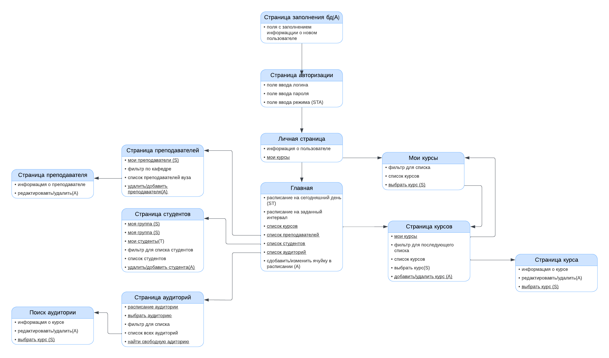

# Учебное расписание (Sheduler)

 

## Схема сайта

 

## Описание страниц

 

С любой страницы можно перейти на главную и личную страницы

Режимы:

* (S) - student
* (T) - teacher
* (A) - administrator

 

**Страница с авторизацией**
1) Поля для ввода логина, пароля и режима (STA)
2) Для администратора конпка перехода на страницу заполнения бд

**Страница заполнения бд**
1)Форма для заполнения/дополнения/редактирования бд с пользователями
   
**Главная страница**
1) Прежде всего авторизация
2) После авторизации становится доступной главная страница, на которой отображено расписание на сегодня (ST)
3) Кнопка расписания на заданный интервал(филтр по времени)
4) Переход на страницу со списком курсов
5) Переход на страницу со списком преподавателей
6) Переход на страницу со списком студентов
7) Список аудиторий
9) добавить/изменить ячуйку в расписании (A)

 

**Страница курсов**
1) Кнопка добавить курс (A)
2) Кнопка мои курсы (ST) - из списка останутся только курсы, проходящиеся студентом(S), ведущиеся преподавателем(T)
3) фильтр - все/спец/обязательные, по номеру курса, по кафедре
4) список всех курсов (название + семестр проведения/для каких курсов доступен) 
6) Напротив спецкурса кнопка добавить(плюсик) (S)
7) Напротив курса кнопка редактирования курса (или удалить) (TA)
 

**Страница курса**
1) Заполнить информацию о курсе и редактировать её(A)
2) Кнопка выбрать курс(S)
3) Список слушателей(TA)
4) Информация о курсе (время, список преподавателей, аудитория, объем)
 

**Мои курсы**(TA)
1)список курсов (навзвание + список слушателей(T))
2)Выбрать курс (S)
 

**Список слушателей курса**
1) Список студентов
2) Кнопка дбавить студента
 

**Страница преподавателей**
1) Кнопка мои преподаватели (S) - текущие преподаватели
2) Фильтр по кафедре, курсу для списка
3) Список преподавателей вуза(имя + кафедра), если (A) - кнопка удалить преподавателя напротив

 

**Страница преподавателя**
1) Информация о преподавателе
2) Редактировать(A)
   
 

**Страница студентов**
1) кнопка моя группа (S)
2) Кнопка мой курс (S)
4) Для преподавателя предусмотрена кнопка "мои студенты" с фильтром по курсам преподавателя (T)
5) Список преподавателей вуза (при нажатии - информация для связи, информация о преподающихся курсах и текущем распиании(где найти?))
6) Фильтр по курсу, потоку, группе
8) Добавить/удалить студента(A)

**Страница студента**
1)информация о студенте
2)Редактировать/удалить
 

**Страница пользователя** (STA)
1) информация о пользователе (имя, группа, курс, почта, достижения и статус (STA))
2) Кнопка мои курсы (ST)
   
 

**Страница аудиторий**
1) Фильтр для списка
2) выезд расписания аудитории на неделю при вводе номера в графу "расписание аудитории №"
3) Список аудиторий (при нажатии - информация о вместительности, формате(поточная, кабинет) и расположении)
4) кнопка "найти свободную аудиторию"
   
 

**Найти свободную аудиторию**
1)в графе вводится интересующий промежуток времени и тип (поточная/кабинет), затем выдаётся инфорамция об удовлетворяющих условиям аудиториях

 

## Сценарии использования

На главную страницу и в личный кабинет можно попасть с любой страницы

 

Получение списков студентов по потокам и группам
Получение списков преподавателей, в т.ч. по проводимым курсам
Получение списков аудиторий, свободных в определенном интервале

**Для студента (S)**
1) Добавление спецкурса (главная -> список курсов -> страница курсов -> выбрать курс)
   
 

**Для преподавателя (T)**
1) Добавление студента на спецкурс (главная -> мои курсы -> список слушателей -> добавить слушателя)
2) Получение списка студентов курса (личная страница -> мои курсы -> из -> список слушателей)
 

**Для администратора университета (A)**
1) Удаление/редактирование студентов (главная -> список студентов -> страница студента -> удалить/редактировать)
2) Добавление студентов (главная -> список студентов -> добавить студента -> новая пустая страница студента)
3) Удаление/редактирование преподавателей (главная -> список преподавателей -> страница преподавателея -> удалить/редактировать)
4) Добавление преподавателей (главная -> список преподавателей -> добавить преподавателя -> новая пустая страница преподавателя)
5) Удаление/редактирование курсов (главная -> список курслв -> страница курса -> удалить/редактировать)
6) Добавление курсов (главная -> список курслв -> добавить курс -> новая пустая страница курса)

 

**Общее**
1) Получение списков аудиторий, свободных в определенном интервале (главная -> список аудиторий -> ывбрать аудиторию)
2) Получение списков преподавателей, в т.ч. по проводимым курсам(главная -> список преподавателей -> применение фильтра)
3) Получение списков аудиторий, свободных в определенном интервале(главная -> список аудиторий -> выбрать аудиторию)

 

## Схема базы данных

 
