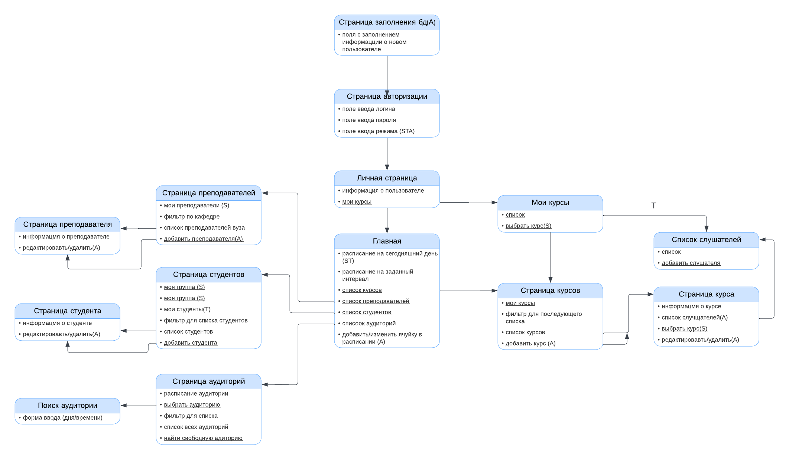

# Учебное расписание (Sheduler)

 

## Схема сайта

 

## Описание страниц

 

С любой страницы можно перейти на главную и личную страницы

Режимы:

* (S) - student
* (T) - teacher
* (A) - administrator

 

**Страница с авторизацией**
1) Поля для ввода логина, пароля и режима (STA)
   
**Главная страница**
1) Прежде всего авторизация
2) После авторизации становится доступной главная страница, на которой отображено расписание на сегодня (ST)
3) Кнопка расписания на заданный интервал
4) Переход на страницу со списком курсов
5) Переход на страницу со списком преподавателей
6) Переход на страницу со списком студентов
7) Кнопка найти свободную аудиторию
8) кнопка с переходом на архив расписаний
9) Составить расписание (A)

 

**Страница курсов**
1) Кнопка добавить курс (TA)
2) Кнопка мои курсы (ST)
3) фильтр - все/спец/обязательные, по номеру курса, по кафедре
4) список всех курсов (при нажатии на курс - всплывает информация о курсе (список преподавателей, аудитория, объем)) 
6) Напротив спецкурса кнопка добавить(плюсик) (S)
7) Напротив курса кнопка редактирования курса (или удалить) (TA)
 

**Страница мои курсы**
1) Список курсов (в начале текущие, затем пройденные (S)), в режиме (T) предоставляется список курсов преподавателя
2) Кнопка выбрать спецкурс -> страница курсов с фильтром спецкурс (S)

 

**Страница преподавателей**
1) Кнопка мои преподаватели (S) - текущие преподаватели
2) Фильтр по кафедре, курсу для списка
3) Список преподавателей вуза, если (A) - кнопка удалить преподавателя напротив

 

**Страница студентов**
1) кнопка моя группа (S)
2) Кнопка мой курс (S)
4) Для преподавателя предусмотрена кнопка "мои студенты" с фильтром по курсам преподавателя (T)
5) Список преподавателей вуза (при нажатии - информация для связи, информация о преподающихся курсах и текущем распиании(где найти?))
6) Фильтр по курсу, потоку, группе
8) Добавить/удалить студента(A)
   
 

**Страница пользователя** (STA)
1) информация о пользователе (имя, группа, курс, почта, достижения и статус (STA))
2) Кнопка мои курсы (ST)
   
 

**Страница аудиторий**
1) Фильтр для списка
2) выезд расписания аудитории на неделю при вводе номера в графу "расписание аудитории №"
3) Список аудиторий (при нажатии - информация о вместительности, формате(поточная, кабинет) и расположении)
4) кнопка "найти свободную аудиторию" - в графе вводится интересующий промежуток времени и тип (поточная/кабинет), затем выдаётся инфорамция об удовлетворяющих условиям аудиториях
   
 

**Архив расписаний**
1) Графа с выбором года для перехода на расписание
   
 

## Сценарии использования

На главную страницу и в личный кабинет можно попасть с любой страницы

 

**Для студента (S)**
1) Студент имеет возможность залогиниться в системе, добавив свои личные данные, в режиме "студент"
2) На главной странице будет отображено расписание сегодняшнего дня
4) Можно нажать на кнопку "расписание недели"
5) Можно получить расписание на заданный интервал времени
6) Можно изменять собственные данные
7) Можно перейти на страницу курсов и добавить себе спецкурс
8) Можно перейти на страницу "мои курсы"
   
 

**Для преподавателя (T)**
1) Преподаватель имеет возможность залогиниться в системе, добавив свои личные данные, в режиме "преподаватель"
2) На главной странице отображено расписание
3) Можно перейти на страницу студентов и, нажав на кнопку "мои студенты", получить список студентов по выбранному курсу
4) Можно получить расписание на заданный интервал времени
5) Можно изменять собственные данные

 

**Для администратора университета (A)**
1) Возможность залогиниться
2) Добавление и удаление курсов
3) Изменять информацию об аудиториях, курсах
4) Создавать ячейки в расписании и менять их
5) Добавления и удаление студентов и преподавателей

 

**Общее**
1) Архив расписаний за прошлые года (выбрать год, курс, группу)
2) Получение списков студентов по потокам и группам
3) Получение списков преподавателей

 

## Схема базы данных

 
